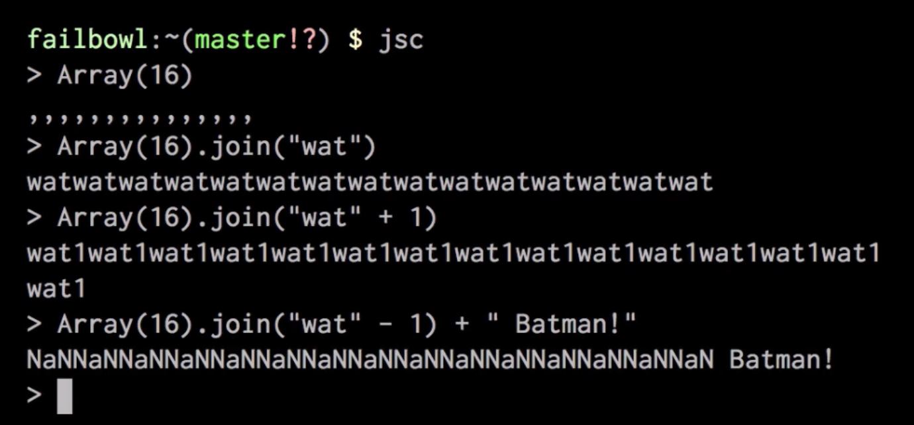

<style>
.reveal section img { background:none; border:none; box-shadow:none; }
</style>

## Of Types and Measures

<a href="https://www.catallaxyservices.com">Kevin Feasel</a> (<a href="https://twitter.com/feaselkl">@feaselkl</a>)
<a href="https://csmore.info/on/types">https://CSmore.info/on/types</a>

---

@title[Who Am I?]

@div[left-60]
<table>
	<tr>
		<td><a href="https://csmore.info"></a></td>
		<td><a href="https://csmore.info">Catallaxy Services</a></td>
	</tr>
	<tr>
		<td><a href="https://curatedsql.com"></a></td>
		<td><a href="https://curatedsql.com">Curated SQL</a></td>
	</tr>
	<tr>
		<td><a href="https://www.apress.com/us/book/9781484254608"></a></td>
		<td><a href="https://www.apress.com/us/book/9781484254608">PolyBase Revealed</a></td>
	</tr>
</table>
@divend

@div[right-40]
	<br /><br />
	<a href="https://www.twitter.com/feaselkl"></a>
	<br />
	<a href="https://www.twitter.com/feaselkl">@feaselkl</a>
</div>
@divend

---?image=presentation/assets/background/measure.jpg&size=cover&opacity=20

### Types and Measures

All programming languages have types.  Some languages have more fleshed-out type systems than others.

Not all languages have the concept of a unit of measure.

---?image=presentation/assets/background/motivation.jpg&size=cover&opacity=20

### Motivation

My goals in this talk:

* Give you a better understanding of types.
* Walk through benefits of the F# type system, including custom types.
* Help you understand sum types versus product types.
* Explain units of measure and where they can help.

---

@title[The Types of Types]

## Agenda

1. **The Types of Types**
2. Product Types
3. Sum Types
4. The Unit Type
5. Custom Types
6. Units of Measure

---?image=presentation/assets/background/birthday-candles.jpg&size=cover&opacity=20

### What is a Type?

At its core, a **type** is a restriction limiting you to certain values.

The `int` type lets you use valid integers (typically within 4 bytes), so "Bob" will never be a proper integer but 3 is.

---

### Why Have Types?


<a href="https://www.destroyallsoftware.com/talks/wat">Wat</a>

---

### Types

With C#, we are used to defining types.

```csharp
int x = 6;
```

Unless we don't want to.

```csharp
var x = 6;
```

---

### Types

With F#, we are used to not defining types.

```fsharp
let x = 6
```

Unless we want to.

```fsharp
let (x:int) = 6
```

---

### Option Types


---?image=presentation/assets/background/choices.jpg&size=cover&opacity=20

### Option Types

The easiest way to avoid null pointer references?  Avoid `null`!

F# has the `Option` type, which may be **either** `Some {object}` or `None`.  Therefore, it always has a value and cannot be `null`.

---?image=presentation/assets/background/demo.jpg&size=cover&opacity=20

### Demo Time

---

@title[Product Types]

## Agenda

1. The Types of Types
2. **Product Types**
3. Sum Types
4. The Unit Type
5. Custom Types
6. Units of Measure

---?image=presentation/assets/background/multiplication.jpg&size=cover&opacity=20

### Product Types

Product types are the combination of multiple values.  The key product types we'll look at are **tuples** and **record types**.

---?image=presentation/assets/background/shoes.jpg&size=cover&opacity=20

### Tuples

Tuples exist in F# and C# both, and with the `System.ValueTuple` library, C# gets many of the in-built F# advantages around tuples.

We write a tuple as a comma-separated list, like `(1, 2, 3, "Dog")` but the complier interprets it as `(int * int * int * string)`.

---?image=presentation/assets/background/pears.jpg&size=cover&opacity=20

### Tuples and the BCL

A tuple is a thing as much as it is a collection of things.

If you are calling a C# (or VB.Net) function from F#, you may only pass in one thing.  If the BCL method has multiple required inputs, you must pass in a tuple.

---?image=presentation/assets/background/record.jpg&size=cover&opacity=40

### Record Types

Record types are product types with labels for each input.  The "development feel" of a record type is similar to that of a `struct` over a class, as record types do not have associated methods, accessors, or mutators.

C# 8.0 will have record types.

---?image=presentation/assets/background/demo.jpg&size=cover&opacity=20

### Demo Time

---

@title[Sum Types]

## Agenda

1. The Types of Types
2. Product Types
3. **Sum Types**
4. The Unit Type
5. Custom Types
6. Units of Measure

---?image=presentation/assets/background/abacus.jpg&size=cover&opacity=20

### Sum Types

In contrast to product types, which are the *product* of multiple inputs, sum types are the *sum* of multiple inputs.

Another way to think of this is, product types chain together `AND` operations, while sum types chain `OR` operations.

---

### Discriminated Union

In F#, the sum type is also known as a **discriminated union**.  We define a thing as one of the valid set.

```fsharp
type DU =
	| Something of type1
	| SomethingElse of type2
	| YetAnotherThing of type3
```

---?image=presentation/assets/background/web.jpg&size=cover&opacity=20

### Why Sum Types?

Sum types replace `if-else` logic and `try-catch` blocks.  Suppose we have a web request.

---

```csharp
try
{
	var result = GetResult(inputs);
}
catch (Exception ex)
{
	throw new ServerSideError(ex);
}

if (result.ResponseCode == ResponseCodes.Success)
{
	return result;
}
else
{
	throw new InvalidResponseError(result);
}
```

---

### Why Sum Types?

```fsharp
let result = GetResult inputs
match result.ResponseCode with
	| ResponseCodes.Success -> result
	| ResponseCodes.Failure -> buildFailure result
	| ResponseCodes.ServerError -> buildServerError result
```

---?image=presentation/assets/background/demo.jpg&size=cover&opacity=20

### Demo Time

---

@title[The Unit Type]

## Agenda

1. The Types of Types
2. Product Types
3. Sum Types
4. **The Unit Type**
5. Custom Types
6. Units of Measure

---?image=presentation/assets/background/water-hole.jpg&size=cover&opacity=20

### The Unit Type

**Unit** is the representation of a category with a single element.

Values go here to die.

---?image=presentation/assets/background/selection.jpg&size=cover&opacity=40

### Why Have a Unit Type?

Unit guarantees that our expressions always return a value.  This is part of the definition of an expression.  The unit type informs us that we don't care about the value, per se, but it is still a value.

C# does not have a unit type and so void versus non-void methods need to remain separate.  This is why we have both `Func` and `Action`.

---?image=presentation/assets/background/demo.jpg&size=cover&opacity=20

### Demo Time

---

@title[Custom Types]

## Agenda

1. The Types of Types
2. Product Types
3. Sum Types
4. The Unit Type
5. **Custom Types**
6. Units of Measure

---?image=presentation/assets/background/easel.jpg&size=cover&opacity=20

### Custom Types

Sometimes the built-in types are too lax.  For example, we can represent a set of prime numbers as an array of integers, but that won't help us avoid slipping in a 4.

This is where custom types come into play.  In C#, you can build a class which behaves like a custom type would.

---?image=presentation/assets/background/no-parking.jpg&size=cover&opacity=20

### Benefits

Additional rules narrow the range of acceptable values beyond what built-in types can handle.

Ensure at compile time that any value of this custom type is guaranteed to follow your rules.

---

### Benefits

Prevent sending in the wrong parameter.

Ever done this before?

```csharp
public int DoSomething (int x, int y) { ... }
DoSomething(y, x);
```

That's because x and y are both integers, so the compiler can't protect us.

---

### Benefits

But this is a lot harder to mess up:

```csharp
public int DoSomething (CustomerID x, ProductID y);
DoSomething(y, x); // Compiler error!
```

Hard to create a class for every possible field, however.

---?image=presentation/assets/background/demo.jpg&size=cover&opacity=20

### Demo Time

---

@title[Units of Measure]

## Agenda

1. The Types of Types
2. Product Types
3. Sum Types
4. The Unit Type
5. Custom Types
6. **Units of Measure**

---?image=presentation/assets/background/suitmeasure.jpg&size=cover&opacity=20

### Units of Measure

Units of measure are not available in C#.  These allow the F# compiler to prevent you from making units-based mistakes, like adding feet and pounds.

---?image=presentation/assets/background/measuring-tools.jpg&size=cover&opacity=20

### Units of Measure

With units of measure, we can:

* Define measures
* Define conversion factors between units
* Add and subtract values of the same unit
* Multiply and divide values of different units
* Solve physics problems

---

### Classic Physics Problem


---

### Less Classic Physics Problem


---?image=presentation/assets/background/demo.jpg&size=cover&opacity=20

### Demo Time

---?image=presentation/assets/background/wrappingup.jpg&size=cover&opacity=20

@title[Wrapping Up]

### Wrapping Up

F# extends the native .NET type system.  Important things we covered today include:

* Option types
* Product types (tuples and records)
* Sum types (discriminated unions)
* Unit type
* Building custom types
* Units of measure

---

### Wrapping Up

To learn more, go here:  <a href="https://csmore.info/on/types">https://CSmore.info/on/types</a>

And for help, contact me:  <a href="mailto:feasel@catallaxyservices.com">feasel@catallaxyservices.com</a> | <a href="https://www.twitter.com/feaselkl">@feaselkl</a>
